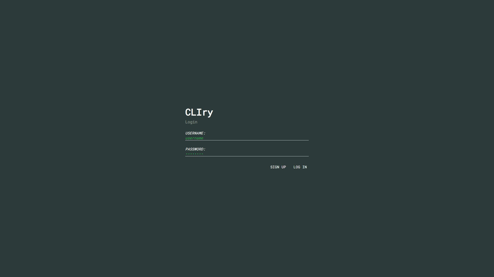
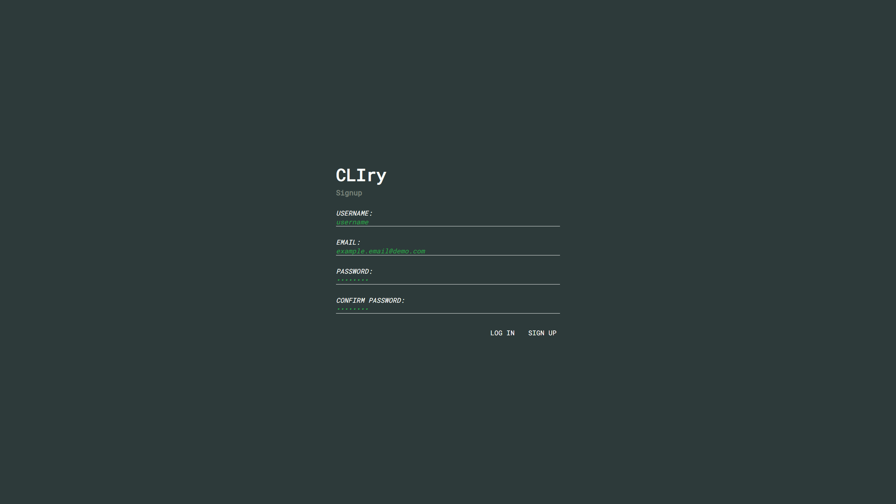

# CLIry
CLIry (pronounced C-L-I-ry or cl-eye-ry) is essentially a diary service. Entries to the diary are primarily read and written through a CLI application (hence the name), however a website is also available for reading and writing entries.

CLIry is currently in very early alpha.

## Screenshots

